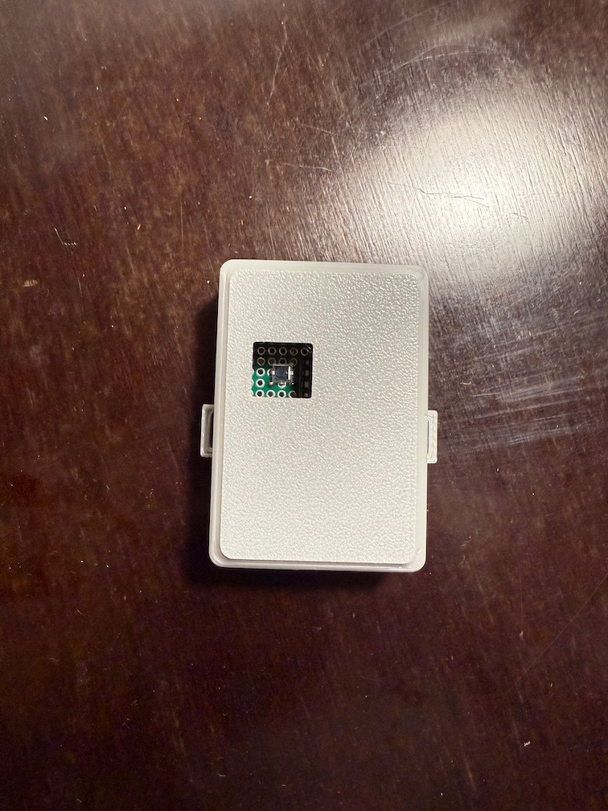
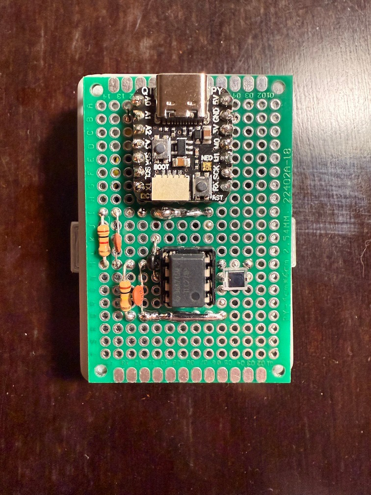

# click2photon

End-to-end display latency measurement: the time from a mouse click to a visible
change on screen, measured with a photodiode strapped to the monitor.

**How it works:**

- An RP2040 sends a USB HID mouse click
- The color switcher app toggles the screen black/white
- The photodiode picks up the change
- The RP2040 streams ADC samples over serial
- The host logs them to CSV
- `analyze.py` computes the latency

## Components

| Component | Path | Description |
|---|---|---|
| Hardware | `hardware/` | KiCad PCB, breadboard/perfboard layout, and 3D-printable enclosure for the sensor (BPW34 photodiode + TLC271IP transimpedance amplifier). |
| Firmware | `arduino/` | Runs on an Adafruit QT Py RP2040. Fires the mouse click, samples the photodiode (14-bit ADC, 12,000 samples per run), sends results as CSV lines over serial. Flash with `./flash_rp2040.sh`. |
| Host software | `main.py` | Interactive serial terminal. Starts/stops test runs, configures click count and interval, logs device data to `output/*.csv`. |
| Analyzer | `analyze.py` | Computes latency from a session CSV: delta-from-baseline threshold detection, reports per-click latency plus mean/sd/median/min/max. |
| Color switcher | `color-switcher-vulkan/` | C++ Vulkan app that toggles the screen black/white on click, built for minimal rendering latency. Build with `./build_vulkan.sh`, run with `./run_vulkan.sh`. |

## Images

 

## Host software CLI (`main.py`)

Connects to the device on `/dev/cu.usbmodem101` at 115200 baud and provides an
interactive prompt:

| Command | Description |
|---|---|
| `start` | Start a test session (3s countdown). Logs to `output/<timestamp>_session.csv`. |
| `stop` | Stop the test and close the session CSV. |
| `debug`, `d` | Enable debug mode — device streams raw ADC readings and voltage. |
| `interval <float>`, `i <float>` | Set the time between clicks in seconds (default 0.5). |
| `clicks <int>`, `c <int>` | Set the number of clicks per session (default 10). |
| `connect` / `disconnect` | Open / close the serial connection. |
| `help` | Show the command list. |
| `exit`, `quit` | Disconnect and quit. |

## Usage

```sh
uv sync                     # set up Python environment
./run_vulkan.sh             # start the color switcher on the monitor under test
uv run main.py              # connect to the device, then type: start
uv run analyze.py output/<session>.csv
```

## Similar tools

Multiple similar (and likely better) tools / devices exist:

- [m2p-latency](https://github.com/davidramiro/m2p-latency)
- [Open-Source-LDAT](https://github.com/S4N-T0S/Open-Source-LDAT)
- [OSLTT](https://github.com/OSRTT/OSLTT)

As well as amazing articles detailing the process and results:

- By @farnoy: [Linux latency measurements and compositor tuning](https://farnoy.dev/posts/linux-latency)
- By @davidramiro: [Building an Input Latency Meter (Because ‘Wayland Feels Off’ Isn’t a Metric)](https://davidjusto.com/articles/m2p-latency/)

For fun, I let Claude Fable 5 compare the 4 projects: [COMPARISON.md](./COMPARISON.md).